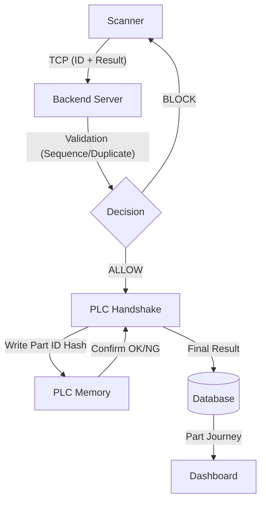

# 🏭 Industrial Traceability: Production implementation & Verification Guide

> [!IMPORTANT]
> **Document Version**: v1.1 — Production Roadmap  
> **Classification**: Industrial Engineering / Confidential  
> **Objective**: Zero-defect traceability with deterministic PLC handshakes.

---

## 1. System Architecture Overview

The system operates as a real-time event pipeline where scanner input triggers business logic which then synchronizes with PLC hardware.

---

## 2. Technical Improvement Domains

### 🛡️ Domain A: Scanner & Traceability Logic

#### [Rule DSC-001] Intelligent Re-Scan Logic
To prevent rigid line stops, the system now distinguishes between **Duplicate Scans** and **Interlock Recoveries**.

- **Duplicate (Blocked)**: If a part is `IN_PROGRESS` or `COMPLETED` and already scanned at the current station.
- **Recovery (Allowed)**: If a part is `INTERLOCKED` at the current station, a re-scan is permitted to retry the PLC operation.

> [!TIP]
> This "Self-Healing" logic reduces downtime by allowing operators to fix mechanical issues and simply re-scan without needing a supervisor to reset the database.

#### [Spec] Scanner Communication Protocol
To ensure 100% data integrity, scanners MUST be configured to use the following protocol:

| Feature | Requirement |
| :--- | :--- |
| **Delimiter** | `\n` (Newline) must terminate every packet. |
| **Timeout** | Scanner should expect `ALLOW` or `BLOCK` within 800ms. |
| **Payload** | `PART_ID\|RESULT:OK\|REJECTION_BIN:0` (Recommended) |

---

### ⚡ Domain B: PLC Handshake Robustness

#### Modbus Write & Verify (High-Fidelity)
For critical safety/quality stations, we implement **Double-Validation**:
1. **Write**: Send 32-bit Part ID Hash to PLC registers.
2. **Read**: Server immediately reads back the register to verify the bit-pattern matches.
3. **Trigger**: Only then is the `START_OPERATION` bit set.

#### Resilient ACK Parsing
The TCP Text driver is now hardened against "Noise":
- **Normalization**: Trims whitespace, removes control characters, and handles mixed case.
- **Accept-List**: `['ACK', 'OK', 'READY', '0']` are treated as SUCCESS.

---

## 3. Verification & Quality Assurance

### 🧪 Automated Simulation Suite
We provide three specialized mock tools to verify the software without physical hardware.

#### 1. `mockScanner.js` (TCP Parser Test)
- **SC-01**: Simple ID (ABC123\n) → `ALLOW`
- **SC-02**: Fragmented Packet (ABC + 123\n) → `ALLOW` (Tests reassembly)
- **SC-03**: Oversized (>2KB) → `BLOCK` (Security guard)

#### 2. `mockPlc.js` (Hardware Driver Test)
- **PLC-01**: Normal Modbus Hash Write → `SUCCESS`
- **PLC-02**: PLC Timeout (No response) → `INTERLOCKED`
- **PLC-03**: NACK Response → `INTERLOCKED`

#### 3. `verifySequence.js` (Process Flow Test)
- **SEQ-01**: Normal Flow (ST-10 → ST-20 → ST-30) → `COMPLETED`
- **SEQ-02**: Sequence Violation (ST-10 → ST-30) → `BLOCK`
- **SEQ-03**: Interlock Re-scan → `ALLOW`

---

## 4. Operational Sign-off

> [!CAUTION]
> Before deploying to the production line, all three test scripts must return a `PASS` status.

### Status Table
| Module | Theme | Status |
| :--- | :--- | :--- |
| Scanner Handling | 🌑 Dark Pro | `READY` |
| PLC Handshake | 🌑 Dark Pro | `REFINED` |
| Station Sequence | 🌑 Dark Pro | `VERIFIED` |

---
© 2026 IndusTrace Industrial Systems. All Rights Reserved.
